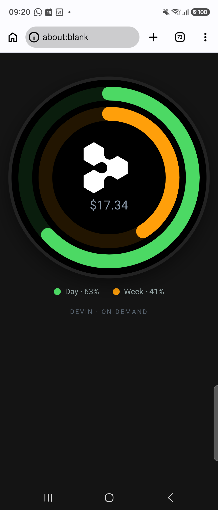

# factory-android-badges

A phone acting as a **BLE gateway**: it fetches one provider's usage from
[factory](https://github.com/jethac/factory-smartscreen) and mirrors it, as an
Apple-Watch-style face, onto one or more **E87 round LED badges** — keeping the
whole fleet in sync.

First provider is **Devin**: its mark in the middle, on-demand spend in small
grey text below, and two activity rings — **outer = day, inner = week**.

## Why this exists / how it relates to factory

`factory-smartscreen`'s README anticipated it:

> `factory_client.dart` is the reusable half: the wall fetches the whole board,
> and **a phone acting as a BLE gateway for ESP32 round displays** calls
> `fetch(ids: [...])` for the three or four tiles it forwards.

So the data half — `lib/factory_client.dart`, `lib/provider_marks.dart`,
`lib/tile_groups.dart` — is **vendored verbatim** from factory and used
unchanged. This repo adds the badge half: the JieLi/E87 BLE protocol and the
face renderer.

> **Note on the badge chip.** These "E87 / L8" badges (sold under many names,
> incl. the *B-431*) are **JieLi AC697**, not ESP32 — the factory README's
> "ESP32 round displays" is the generic label. The protocol here is JieLi RCSP
> over BLE. See `NOTES.md`.

## Shape

    lib/factory_client.dart    vendored — talks to factory, knows nothing about badges
    lib/provider_marks.dart    vendored — mark + brand colour per owner
    lib/tile_groups.dart       vendored — ownerOf(tile)
    lib/config.dart            local facts: factory URL/token, badge ids, Devin tile ids
    lib/e87/                   the JieLi/E87 BLE protocol, ported from the Python reference
      e87_const.dart             UUIDs, FE framing, transfer defaults
      crc.dart                   CRC-16/XMODEM
      jieli_cipher.dart          the RCSP auth block cipher (byte-exact port; test-vector'd)
      frame.dart                 FE DC BA … EF framing
      notify_bus.dart            predicate waiters over incoming notifications
      auth.dart                  6-step mutual handshake
      upload_session.dart        the 9-phase windowed upload state machine
      e87_client.dart            connect + MTU 517 + subscribe + auth + push (flutter_blue_plus)
    lib/render/
      provider_face.dart         paints the watch face → 368×368 JPEG
      devin_face.dart            maps a factory Board → a Devin FaceModel
    lib/badge_sync.dart        fetch → render once → push to every badge, on an interval
    lib/main.dart              control-surface UI: preview, scan, per-badge status

## Status — unbuilt

This was authored without a Flutter toolchain on hand, so **it has not been
compiled or run yet.** The protocol is a faithful port of the working Python
reference (`jumpingmushroom/e87_badge`) and the auth cipher carries the captured
test vector (`test/jieli_cipher_test.dart`). Expect to:

1. `flutter pub get`
2. `flutter test` — confirms the cipher + CRC ports byte-for-byte.
3. Fill in `lib/config.dart`: factory `baseUrl` + `token`, the Devin tile ids
   your `/api/display` actually returns, and each badge's BLE id (use the app's
   scan button to discover them).
4. `flutter run`, then **Sync now**.

The one protocol risk proven on hardware (see `WORKLOG.md`): Chrome-on-Android
caps GATT writes at 512 bytes, which broke the Web Bluetooth client. This native
client requests **MTU 517** and uses **490-byte chunks** (503-byte frames), so
it stays under the ATT limit and avoids that failure.

## Setup — badges

Each badge advertises as `E87`. Tap the scan icon, copy its id, and add it to
`AppConfig.badges` in `lib/config.dart`. A push takes ~5–15 s per badge and the
badge shows a "receiving" animation while it lands (firmware-driven; see
`NOTES.md` — there is no silent-update path in the protocol).

## Credits / licence

- Data client + marks: vendored from `jethac/factory-smartscreen`.
- E87 protocol + JieLi auth cipher: ported from `jumpingmushroom/e87_badge` and
  `hybridherbst/web-bluetooth-e87` (MIT, © 2026 Felix Herbst).
